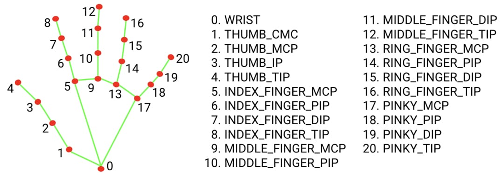

# Gesture Volume Control

#  Hand Landmarks used in Tracking


## **Tech Stack Used** 

1. OpenCV
2. MediaPipe
3. Numpy
4. time
5. Pycaw

## Importing pakages

```python

!pip install mediapipe
     

import os
os.environ['TF_ENABLE_ONEDNN_OPTS'] = '0'
import cv2
import time
import numpy as np
import math
import Hand_tracking_module as htm # ----> custom made module 
## ----- Taken From PyCaw -------##
from comtypes import CLSCTX_ALL
from pycaw.pycaw import AudioUtilities, IAudioEndpointVolume 

```
## Setting up webcam and making handDector class object

```python
wCam , hCam = 640, 480
cap = cv2.VideoCapture(0)
cap.set(3, wCam)
cap.set(4, hCam)
pTime = 0
detector = htm.handDetector(detectionCon=0.7)
  ```
## Setting up Volume setting using Pycaw
     
```python


devices = AudioUtilities.GetSpeakers()
interface = devices.Activate(
    IAudioEndpointVolume._iid_, CLSCTX_ALL, None)
volume = interface.QueryInterface(IAudioEndpointVolume)
volRange = volume.GetVolumeRange()

minVol = volRange[0]
maxVol = volRange[1]
vol = 0
volBar = 400
volPer = 0
       
```
## Linking Hand Landmarks with Volume settings

```python
while True:
    success, img = cap.read()
    img = detector.findHands(img)
    lmList = detector.findPositiion(img, draw=False)
    if len(lmList)!=0:
        # print(lmList[4], lmList[8])

        x1, y1 = lmList[4][1], lmList[4][2]
        x2, y2 = lmList[8][1], lmList[8][2]
        cx, cy = (x1 + x2)//2, (y1 + y2)//2

        cv2.circle(img, (x1, y1), 10, (255,0,255), cv2.FILLED)
        cv2.circle(img, (x2, y2), 10, (255,0,255), cv2.FILLED)
        cv2.circle(img, (cx, cy), 10, (255,0,255), cv2.FILLED)
        cv2.line(img, (x1, y1), (x2, y2), (255, 0, 255), 3)

        length = math.hypot(x2-x1, y2-y1)
        # print(length)

        ## Hand range --> 20 - 230
        ## Volume range --> -65 - 0

        vol = np.interp(length, [20, 230], [minVol, maxVol])
        volBar = np.interp(length, [20, 230], [400, 150])
        volPer = np.interp(length, [20, 230], [0, 100])

        # print(int(length), vol)
        volume.SetMasterVolumeLevel(vol, None)

        if length<20:
            cv2.circle(img, (cx, cy), 10, (0,255,0), cv2.FILLED)
    
    cv2.rectangle(img, (50,150), (85,400), (255,0,0), 3)
    cv2.rectangle(img, (50,int(volBar)), (85,400), (255,0,0), cv2.FILLED)
    cv2.putText(img, f'{int(volPer)}%', (40,450), cv2.FONT_HERSHEY_COMPLEX, 0.75, 
                (255, 0, 0), 2)
    
    cTime = time.time()
    fps = 1/(cTime - pTime)
    pTime = cTime
    cv2.putText(img, f'FPS: {int(fps)}', (40,40), cv2.FONT_HERSHEY_COMPLEX, 0.75, 
                (255, 0, 0), 2)
    cv2.imshow("Image", img)
    if cv2.waitKey(1) & 0xFF == ord('q'):
        break
```      
